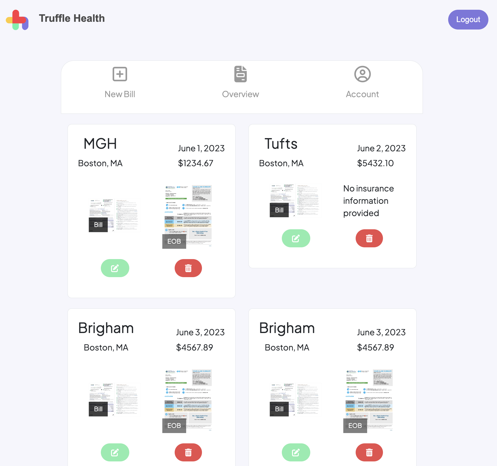

# Truffle Health User Interface

This comprehensive web application was developed for Truffle Health, a platform focused on simplifying medical billing processes while incorporating intelligent algorithms to help users identify errors and discrepancies in their medical bills. The app, built with Django as the backend framework and React as the frontend framework, provides a seamless user experience for managing medical bills. Users can register and log in, upload itemized bill and Explanation of Benefits (EOB) images, view an overview of their bills, and update their personal details easily. The Truffle Health User Interface showcases my full-stack development skills and demonstrates my ability to create a functional and user-friendly healthcare management system.

## 🚀 Project Overview

Truffle Health is developing a new user interface for their medical bill upload system. The current system relies on a Google Form for bill submission, with styling applied using FormFacade. However, to provide a more robust and user-friendly experience, Truffle Health is building a custom user interface from scratch. The new UI will streamline the bill upload process, provide real-time feedback and validation, and offer additional features to improve the overall usability of the platform.

## Tech

- Backend: Django framework
- Frontend: React framework
- Deployment: Render (frontend and server deployed together)
- Database: PostgreSQL (hosted separately)

## 🌐 Deployment Link

The Truffle Health User Interface, including the frontend and server, has been deployed using Render and is accessible [here](https://medical-bills.onrender.com/). The PostgreSQL database is hosted separately.

## 🐛 Known Bugs

- One issue occurs when uploading a bill, where accessing the bill overview page and then attempting to edit the bill can result in the images being mixed up or even deleted. This issue needs to be resolved to ensure a seamless experience for users and maintain the integrity of the uploaded bill data.

## 🚀 Future Improvements

- Expand file upload capabilities to support a wider range of file formats beyond JPG and PNG, such as PDFs or documents, thereby accommodating different bill formats.
- Add a customizable field where users can input their own name or description for each bill to personalize their bill entries, such as labeling them as "Yearly Physical" or "Specialist Consultation."
- Implement a status feature for each bill, allowing the team at Truffle Health to assign statuses such as "Under Review," "Under Appeal," or "Due Date Extended" as they process the bills, providing users with visibility into the progress.
- Improve form validation for required fields such as Date of Birth, address, and itemized bill image.

## 🪴 About Me
I'm a freelance full stack developer with a passion for crafting innovative web solutions. With expertise in both front-end and back-end technologies, I have successfully delivered a wide range of projects, including web applications, RESTful APIs, and database management. I continually strive to solve complex problems and provide efficient, user-friendly solutions.

## Contact

If you have any questions or would like to discuss potential opportunities, please feel free to reach out to me. You can contact me  through the following channels:

